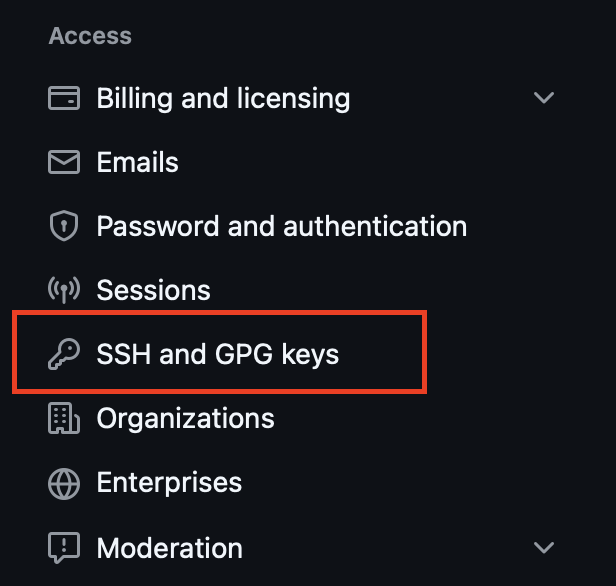
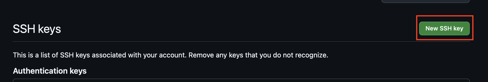
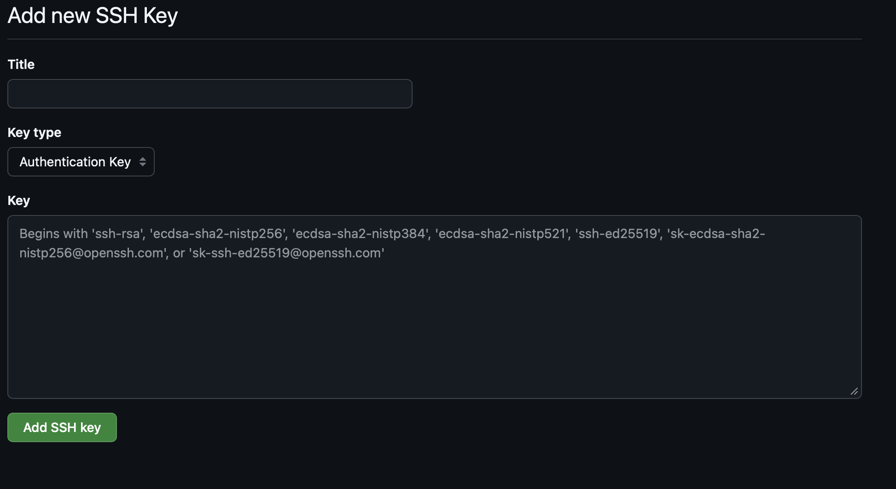

# SSH Keys

A short tutorial on how to set up ssh keys for using Github

SSH can be used alongside git to send git data through SSH tunnels. To do this however, you need to establish a public-private keypair between the remote host (where the remote repository is stored) and the client machine. In this scheme, the client will hold onto the private key and share the public key to the remote machine.

During data transmission, the client will use the private key to authenticate with the remote host and open an encrypted SSH tunnel. Git then uses this tunnel to send information to and from the host.

## Generating an SSH Key

Unix Machines:

1. On the client machine, run `ssh-keygen` in the terminal.
2. Follow the instructions to generate a public-private keypair.
3. Note the location that the command stores the generated keys (Usually in the ~/.ssh/ directory).

Notes:

When prompted for the file name, enter the path of the key file (best to put in the .ssh folder in the home directory) and name the file so that you know which github account the key is linked to.

The command will generate two files. The public key will be stored in the `*.pub` file. The private key is stored in the file with no extension. Make sure to only export the contents of the `.pub` file and NOT the private key. This is extremely important.

## Adding the SSH Key to Github

Once you have generated a public-private key pair, open github and navigate to your profile settings. There should be a tab about SSH keys and GPG keys.

---



---

Press 'new SSH key'.

---



---

Add the contents of the public key to the field below. You want to then name the key accordingly so you know which device the public key corresponds to.

---



---

Now github is configured to transfer files with SSH!

## Configuring Git

Now that you have a public and private key pair, you need to configure your local git. There are two ways you can do this. The first option is to [manually modify the global/local .gitconfig file](#modifying-gitconfig-manually). The second option is to use [git commands to modify the .gitconfig file](#using-git-commands-to-configure-git).

### Modifying .gitconfig Manually

To modify the global git settings, open the .gitconfig in the home directory (If you want to do it for a local directory, open the .git directory and there should be a config file inside).

In the config file, there should be a "core" section. If not, add ```[core]``` section in the config file (aligned left). Under the core section (indented by one), add the following line: ```sshCommand = ssh -i {/path/to/private/key/file}```

Also make sure that the user section is correctly configured with your email and username. You can do so by adding a ```[user]``` section with the fields, ```name = ...``` and ```email = ...```

The final result should look like the following:

```ini
[core]
    sshCommand = ssh -i {/path/to/private/key/file}
[user]
    name = YourName
    email = email@email.dom
```

Now git should be configured correctly to use ssh keys!

### Using Git Commands to Configure Git

You may also modify the configuration of git using git commands:

#### Configuring the SSH Command

```git config --{global/local} core.sshCommand "ssh -i {/path/to/private/key/file}"```

#### Configuring User Fields

```git config --{global/local} user.name "..."```

```git config --{global/local} user.email "..."```

For each of these commands, you may choose to configure the local directory or the global git setting.

Under the hood, these commands just modify or write to the relevant .gitconfig file.
